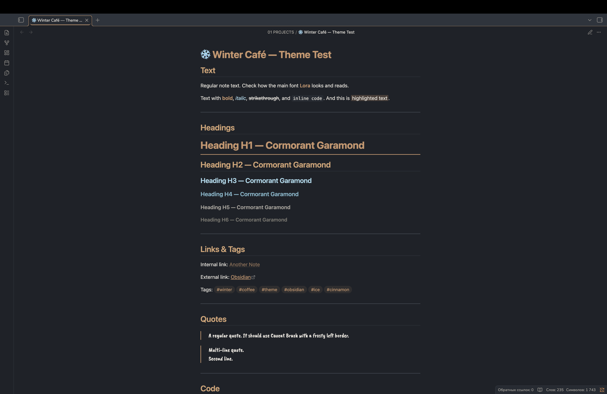
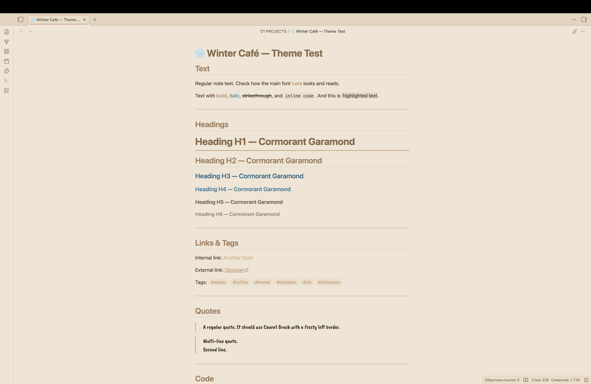

# ❄️ Winter Café — тема для Obsidian

Уютная зимняя тема для [Obsidian](https://obsidian.md) с мягкими латте-оттенками, тёплыми акцентами корицы и нежными морозными деталями. Создана для спокойных вечеров, тёплых напитков и комфортной работы с заметками.

---

## 📑 Оглавление

- [✨ Особенности](#features)
- [📸 Скриншоты](#screenshots)
- [📦 Установка](#installation)
- [🎨 Цветовая палитра](#color-palette)
- [🛠️ Настройка](#customization)
- [🚧 Планы](#roadmap)
- [💡 Поделись идеей](#ideas)

---

<a id="features"></a>

## ✨ Особенности

- 🎨 Уютная зимняя палитра с латте, корицей и морозно-голубыми тонами
- 🌓 Поддержка тёмной и светлой темы
- ☕ Тёплый латте-фон в светлой теме для комфортного чтения
- 📝 Книжная типографика со шрифтами Lora, Cormorant Garamond и Nunito Sans
- 🎯 Контрастность соответствует стандартам WCAG для доступности
- ✨ Жёстко заданные акцентные цвета, которые переопределяют настройки пользователя
- 🍂 Кастомные элементы: теги, чекбоксы, цитаты и сворачиваемые блоки
- 🖊️ Плавные анимации и переходы

---

<a id="screenshots"></a>

## 📸 Скриншоты

### Тёмная тема



### Светлая тема



---

<a id="installation"></a>

## 📦 Установка

### Из магазина тем Obsidian

1. Открой настройки Obsidian
2. Перейди в **Оформление** → **Темы** → **Управление**
3. [Найди Winter Café в магазине сообщества](https://community.obsidian.md/themes/winter-cafe)
4. Нажми **Установить**, затем **Применить**

   > Примечание: тема на модерации в магазине **Obsidian**

### Ручная установкаß

1. Скачай файлы `theme.css` и `manifest.json`
2. Создай папку `Winter Café` в каталоге `.obsidian/themes/`
3. Помести туда оба файла
4. Включи тему в настройках Obsidian: **Оформление** → **Темы**

---

<a id="color-palette"></a>

## 🎨 Цветовая палитра

### Тёмная тема

| Элемент   | Цвет      | Описание        |
| --------- | --------- | --------------- |
| Фон       | `#1e2228` | Холодный графит |
| Текст     | `#e8e4dc` | Тёплый белый    |
| Акцент    | `#c9956b` | Корица          |
| Подсветка | `#a8d8ea` | Морозно-голубой |

### Светлая тема

| Элемент   | Цвет      | Описание                 |
| --------- | --------- | ------------------------ |
| Фон       | `#f0e4d4` | Тёплый латте             |
| Текст     | `#3a2e22` | Тёплый тёмно-коричневый  |
| Акцент    | `#a07a5a` | Корица                   |
| Подсветка | `#3a7a95` | Глубокий морозно-голубой |

---

<a id="customization"></a>

## 🛠️ Настройка

### Изменение цветов

Ты можешь изменить цвета, отредактировав CSS-переменные в файле `theme.css`:

```css
--winter-cinnamon: #c9956b; /* Измени на свою корицу */
--winter-caramel: #d4a373; /* Измени на свою карамель */
--winter-ice: #7fb8cc; /* Измени на свой ледяной голубой */
```

### Рекомендуемый акцентный цвет

Для наилучшего восприятия установи в Obsidian акцентный цвет:

- RGB: 201, 149, 107
- HEX: #c9956b

Примечание: Тема жёстко задаёт акцентные цвета, поэтому настройки пользователя будут переопределены.

---

<a id="roadmap"></a>
🚧 Планы

Тема активно развивается. В планах:

- ❄️ Падающие снежинки — мягкая анимация снегопада на фоне
- 🕯️ Иней на границах — лёгкое морозное свечение вокруг элементов
- ✨ Зимнее дыхание курсора — мягкая анимация курсора
- 🌨️ Больше уютных деталей — дополнительные зимние атмосферные элементы

Следи за обновлениями! ☕❄️

---

<a id="ideas"></a>
💡 Поделись идеей

Есть идея для новой функции или уютной детали, которую хотелось бы видеть в Winter Café? Буду рад услышать!
Ты можешь поделиться предложением через:

- 🐛 Создать issue
- 💬 Начать обсуждение
- ✉️ Написать сообщение на форуме Obsidian

Твои идеи помогают сделать тему уютнее для всех! ❄️☕
